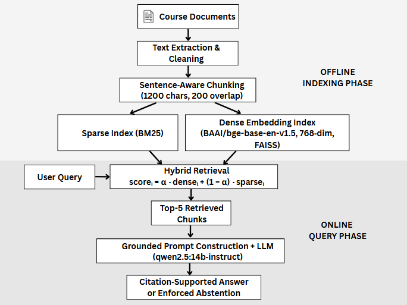

# Hybrid RAG Study Assistant

A grounded hybrid Retrieval-Augmented Generation (RAG) system that combines dense and sparse retrieval with citation enforcement and abstention control.

---

## 🚀 Overview

This project implements a hybrid retrieval pipeline that integrates:

- Dense retrieval (BGE embeddings + FAISS)
- Sparse retrieval (BM25)
- Hybrid score interpolation
- Grounded answer generation
- Citation enforcement
- Abstention mechanism for low-confidence responses

The system is designed to reduce hallucinations while improving retrieval robustness and answer grounding.

---

## 🏗 System Architecture Diagram



The system combines dense and sparse retrieval using score interpolation, followed by grounded generation with citation enforcement and abstention control.

---

## 🏗 System Architecture

### Offline Phase

1. PDF ingestion
2. Text chunking (configurable size and overlap)
3. Sparse indexing (BM25)
4. Dense embedding generation (BGE)
5. FAISS vector indexing

### Online Phase

1. Query embedding
2. Hybrid score computation:

   `hybrid_score = alpha * dense_score + (1 - alpha) * sparse_score`

3. Top-k retrieval
4. Grounded prompt construction
5. Citation-enforced answer generation
6. Abstention if insufficient evidence

---

## 📊 Experimental Results

Hybrid retrieval improves robustness compared to standalone sparse retrieval.

| Alpha | Retrieval Mode | Relative Performance |
| ----- | -------------- | -------------------- |
| 0.0   | Sparse (BM25)  | Baseline             |
| 0.25  | Hybrid         | Improved             |
| 0.5   | Hybrid         | Strong               |
| 0.75  | Hybrid         | Strong               |
| 1.0   | Dense (BGE)    | Competitive          |

The evaluation framework supports configurable alpha sweeps for dense–sparse interpolation experiments.

---

## 🧠 Key Features

- Dense + Sparse hybrid ranking
- FAISS vector similarity search
- SQLite metadata storage
- Modular pipeline design
- Evaluation module for retrieval experiments
- Citation-grounded response generation
- Abstention when evidence is weak

---

## 📂 Project Structure

```
core/         → Retrieval, embedding, and generation logic
ingestion/    → PDF processing and chunking
storage/      → Database layer and schema
evaluation/   → Experimental evaluation framework
```

---

## ⚙️ Installation

Clone the repository:

```
git clone https://github.com/parkjw5/hybrid-rag-study-assistant.git
cd hybrid-rag-study-assistant
```

Install dependencies:

```
pip install -r requirements.txt
```

---

## ▶️ Run the Application

```
python app.py
```

---

## 🎯 Future Improvements

- Cross-encoder reranking
- Streaming response support
- Web interface (Streamlit or FastAPI)
- Retrieval benchmarking on larger corpora
- Deployment-ready API version

---

## 📌 Tech Stack

- Python
- FAISS
- BM25
- SQLite
- HuggingFace embeddings
- Large Language Models (LLMs)

---

## 📄 License

MIT License
